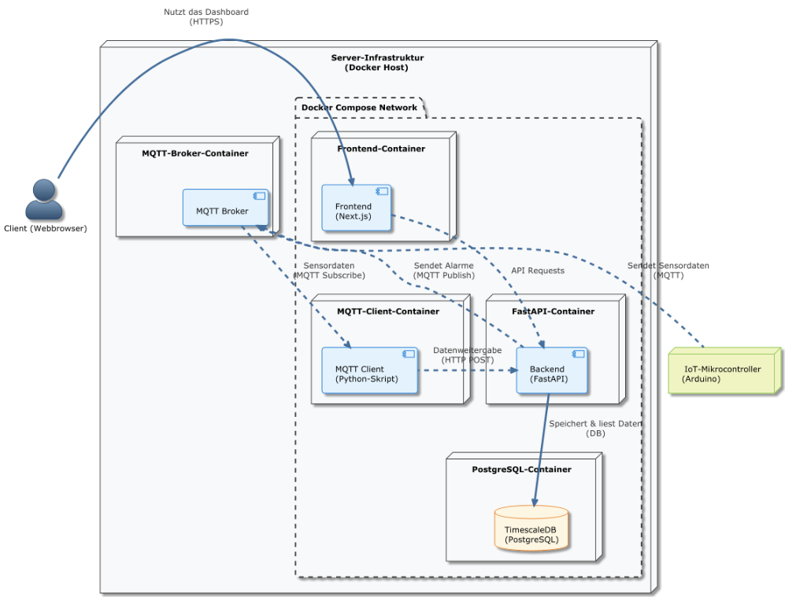

# Architektur

## Frontend to Backend Kommunikation

## Übersicht (Deployment)

| Baustein                      | Technologie                                      | Aufgabe & Verantwortung                                                                                                                                                                                                           | Kommuniziert mit                                 |
|-------------------------------|--------------------------------------------------|-----------------------------------------------------------------------------------------------------------------------------------------------------------------------------------------------------------------------------------|--------------------------------------------------|
| Client (Webbrowser)           | Standard-Webbrowser                              | Stellt die Benutzeroberfläche (das Dashboard) dar, die vom Frontend-Server geliefert wird. Ermöglicht dem Benutzer die Interaktion mit dem System (Daten ansehen, Einstellungen ändern).                                          | Frontend                                         |
| IoT-Mikrocontroller (Arduino) | Hardware (z.B. ESP32, Arduino) mit MQTT-Bibliothek | Erfasst die physischen Messwerte (z.B. Temperatur, Feuchtigkeit) und sendet diese als Nachrichten an den MQTT-Broker. Ist die primäre Datenquelle.                                                                                | MQTT Broker                                      |
| Server-Infrastruktur          | Physischer/Virtueller Server mit Docker Engine    | Dient als Host-System, das alle Anwendungscontainer ausführt und verwaltet. Stellt die notwendigen Ressourcen wie CPU, RAM, ... bereit.                                                                                           | – (Verwaltet alle Container)                     |
| Frontend                      | Next.js (React-Framework)                        | Liefert die Benutzeroberfläche an den Browser des Clients. Fragt Daten über die API des Backends ab und visualisiert sie. Sendet Benutzeraktionen an das Backend.                                                                 | Client (Webbrowser), Backend                     |
| Backend                       | FastAPI (Python-Framework)                       | Ist das "Gehirn" der Anwendung. Stellt eine REST-API für das Frontend bereit, nimmt weitergeleitete Sensordaten entgegen, validiert diese, prüft auf Alarmbedingungen, speichert Daten in der Datenbank und sendet Alarme.        | Frontend, MQTT Client, TimescaleDB, MQTT Broker  |
| MQTT Client                   | Python-Skript                | Dient als reiner Daten-Weiterleiter. Abonniert die Sensor-Topics beim Broker, empfängt die Rohdaten und schickt sie per HTTP-Request zur Verarbeitung an das Backend. Entkoppelt das Backend von der direkten MQTT-Kommunikation. | MQTT Broker, Backend                            |
| TimescaleDB                   | PostgreSQL-Datenbank mit TimescaleDB-Erweiterung | Ist der persistente Datenspeicher des Systems. Speichert sowohl die Zeitreihendaten der Sensoren (optimiert durch TimescaleDB) als auch die relationalen Daten (Benutzer, Lagerorte etc.).                                        | Backend                                          |
| MQTT Broker                   | MQTT-Broker-Software (z.B. Mosquitto)            | Fungiert als zentrale Nachrichten-Drehscheibe für die Echtzeitkommunikation. Empfängt die Daten von den IoT-Geräten und verteilt sie an alle Abonnenten (hier: den MQTT Client). Nimmt zudem Alarme vom Backend entgegen.         | IoT-Gerät, MQTT Client, Backend                  |
| Docker Compose Network        | Docker Networking                                | Ist ein virtuelles, privates Netzwerk. Ermöglicht den Containern eine sichere und einfache Kommunikation untereinander über deren Service-Namen, ohne dass jeder Container-Port nach außen freigegeben werden muss.               | – (Ermöglicht die Kommunikation zwischen den Containern) |

## Bausteinsicht
