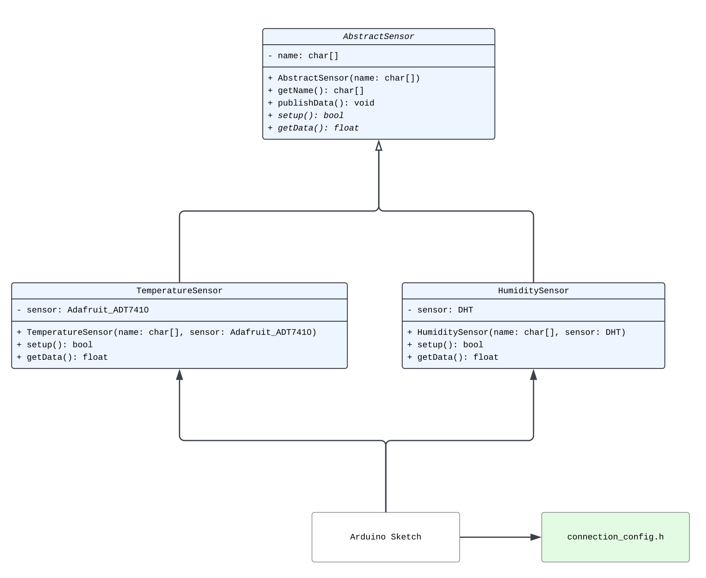

# Arduino Codebase

## Struktur



Die Codebase für das Arduino System ist so aufgebaut, dass eine einfache Einführung von weiteren Sensoren möglich ist.
Um dies zu erreichen wurde eine Klasse `AbstractSensor` angelegt, die allgemeine Eigenschaften und Funktionalitäten
eines Sensors besitzt. Diese sind folgende:

- Jeder Sensor hat einen Namen. Dieser wird einmalig im Konstruktor festgelegt und kann mit der Methode
  `AbstractSensor::getName` gelesen werden. Der Name des Sensors ist lediglich aus Logging-Gründen hilfreich.
- Eine Methode `AbstractSensor::setup` soll einmalig in der `setup` Funktion des Arduino Sketch aufgerufen werden.
  In dieser Methode können beispielsweise die Sensore konfiguriert werden. Diese Methode ist abstrakt und muss in
  geeigneten Unterklassen überschrieben werden.
- Jeder sensor kann Daten als `float` auslesen. Dies wird durch die Methode `AbstractSensor::readData` erreicht.
  Diese Methode ist ebenfalls abstrakt und muss in geeigneten Unterklassen überschrieben werden.
- Zusätzlich gibt es eine Methode, um ausgelesene Daten an den MQTT Broker zu senden. Dies wird durch die Methode
  `AbstractSensor::publishData` erreicht; hierbei werden als Parameter der MQTT Client und das MQTT Topic übergeben
  und eine Nachricht wird damit automatisch an den Broker gesendet. Hier wird die Methode `AbstractSensor::readData`
  verwendet, um die gemessenen Daten auszulesen.

## Watchdog-Integration

Zur Absicherung des Systems gegen dauerhafte Verbindungsprobleme wurde ein Software-Watchdog implementiert. Dieser stellt sicher, dass das System in einem definierten Zeitraum automatisch neu startet, wenn eine Wiederverbindung zum MQTT-Broker nicht gelingt. Diese Funktionalität ist besonders wichtig für produktive Anwendungen mit dauerhafter Datenübertragung, wie im MVP vorgesehen.

### Anforderungen

Im MVP war festgelegt, dass das Gerät sich nach einem Verbindungsverlust innerhalb von **30 Sekunden** wieder mit dem MQTT-Broker verbinden soll. Gelingt dies nicht innerhalb von **3 Versuchen**, muss ein automatischer Neustart erfolgen – idealerweise innerhalb von **20 Sekunden nach letztem Versuch**.
Diese Anforderungen wurden durch folgende Mechanismen erfüllt:

- **Reconnect-Logik** mit Zähler und 30 s-Zeitfenster
- **In-Sketch Watchdog**, umgesetzt über `millis()`-Timing und Neustart via `NVIC_SystemReset()`

### Vergleich alternativer Watchdog-Bibliotheken

Für SAMD21-kompatible Boards existieren mehrere Watchdog-Bibliotheken:

| Bibliothek        | Hardwarebasiert | Einfachheit | Max. Timeout | Verbreitung |
|------------------|-------------|---------|---------------|---------|
| `WDTZero`         | Ja          | Hoch    | 8 s           | Häufig  |
| `Sodaq_wdt`       | Ja          | Mittel | 8 s |️ Weniger verbreitet |
| `WDT_SAMD21`      | Ja          | Mittel | 16 s           |️ Selten |
| `In-Software-Watchdog`    | Nein        | Hoch    |️ frei wählbar | Häufig  |

Die Entscheidung fiel auf **In-Sketch Watchdog**, da sie:

- freie Wahl der Timeout-Dauer (z. B. 20 s) ermöglicht
- keine zusätzliche Bibliothek benötigt
- präzise im Sketch über `millis()` und `NVIC_SystemReset()` arbeitet

### Implementierung

Die Watchdog-Funktionalität wird direkt im Sketch umgesetzt, ganz ohne externe Bibliothek.
Wir verwenden einen millis()-basierten Timer und rufen `NVIC_SystemReset()` auf, wenn seit dem letzten erfolgreichen Poll/Connect mehr als 20 s vergangen sind.

1. **Parameter und State**

    Hier definieren wir die Anzahl der Maximalversuche sowie die Zeitfenster für Reconnect und Reset.
   ```cpp
   const int    MAX_ATTEMPTS         = 3;      // max. Reconnect-Versuche
   const long   RECONNECT_WINDOW_MS  = 30000;  // 30 s-Fenster
   const long   RESTART_TIMEOUT_MS   = 20000;  // 20 s bis Reset

   int          attempts     = 0;
   unsigned long windowStart = 0;
   unsigned long lastConnect = 0;  // Zeitstempel letzten Connects
    ```

2. **Reconnect-Logik und Software-Reset im loop()**

    Im Hauptloop prüfen wir erst, ob die MQTT-Verbindung steht. Wenn ja, pollen wir und setzen den Reset-Timer zurück. Andernfalls versuchen wir bis zu drei Mal, erneut zu verbinden, und starten nach 20 s ohne Erfolg neu.
    ```cpp
    void loop() {
      unsigned long now = millis();

      if (mqttClient.connected()) {
        // Verbindung ok: Poll beantworten und Reset-Timer zurücksetzen
        mqttClient.poll();
        lastConnect = now;

        // Sensor-Daten lesen und veröffentlichen …
        delay(5000);

      } else {
        // Verbindung weg: 30 s-Fenster ggf. zurücksetzen
        if (now - windowStart > RECONNECT_WINDOW_MS) {
          windowStart = now;
          attempts    = 0;
        }
        // Bis zu 3 Reconnect-Versuche
        if (attempts < MAX_ATTEMPTS) {
          if (tryConnectMQTT()) {
            // Erfolg setzt counters zurück
          } else {
            attempts++;
          }
          delay(1000);
        }
        // 20-s-Software-Reset nach letztem Poll/Connect
        if (lastConnect != 0 && now - lastConnect > RESTART_TIMEOUT_MS) {
          NVIC_SystemReset();
        }
      }
    }
    ```

3. **Reconnect-Logik**

    Nach jedem erfolgreichen Connect führt `tryConnectMQTT()` die Rücksetzung von `attempts`, `windowStart` und `lastConnect` durch.
    ```cpp
   if (!mqttClient.connected()) {
      // 30 s-Fenster überwachen
      if (millis() - windowStart > RECONNECT_WINDOW_MS) {
        windowStart = millis();
        attempts    = 0;
      }
      // Bis zu 3 Versuche
      if (attempts < MAX_ATTEMPTS) {
        if (!tryConnectMQTT()) attempts++;
        delay(1000);
      }
   }
    ```
---

### Quellen

- [1] [WDTZero GitHub](https://github.com/javos65/WDTZero)
- [2] [Sodaq_Watchdog Github](https://github.com/SodaqMoja/Sodaq_wdt)
- [3] [WDT_SAMD21 GitHub (Alternative)](https://github.com/gpb01/wdt_samd21)
- [4] [Arduino millis()-documentation](https://docs.arduino.cc/language-reference/en/functions/time/millis/)
- [5] [Long time use of millis](https://forum.arduino.cc/t/using-millis-over-long-time/629975)
- [6] [MQTT-Reconnect-Logik mit ArduinoMqttClient](https://github.com/arduino-libraries/ArduinoMqttClient)
- [7] [NVIC_SystemReset() documentation](https://developer.arm.com/documentation/ddi0403/ee/?lang=en)

