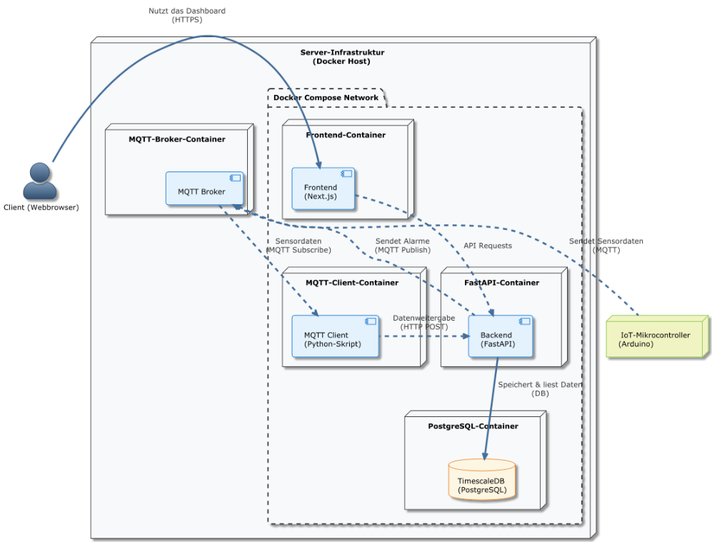
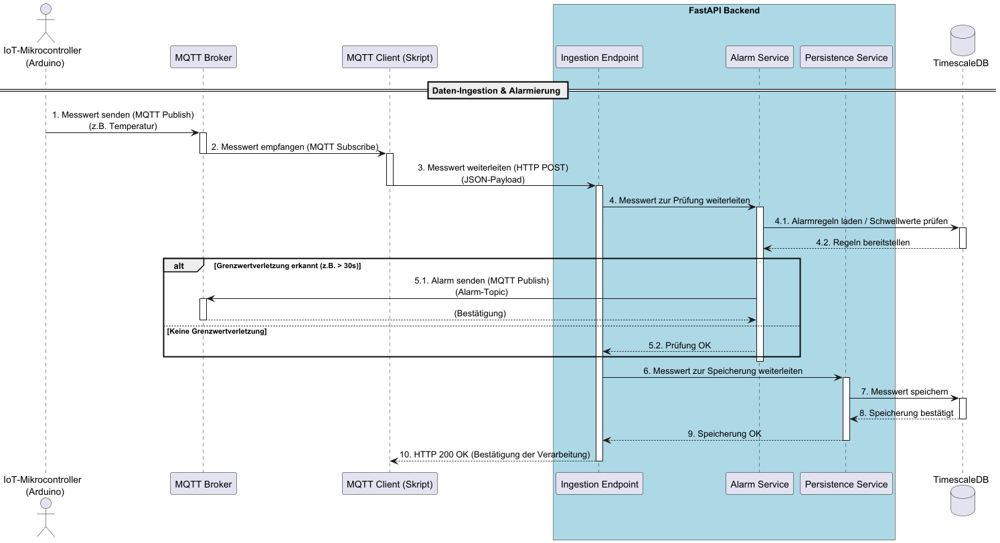

# Architektur

## Übersicht (Deployment)

| Komponente                   | Technologie                                      | Aufgabe & Verantwortung                                                                                                                                                                                                           | Kommuniziert mit                                 |
|------------------------------|--------------------------------------------------|-----------------------------------------------------------------------------------------------------------------------------------------------------------------------------------------------------------------------------------|--------------------------------------------------|
| Client (Webbrowser)          | Standard-Webbrowser                              | Stellt die Benutzeroberfläche (das Dashboard) dar, die vom Frontend-Server geliefert wird. Ermöglicht dem Benutzer die Interaktion mit dem System (Daten ansehen, Einstellungen ändern).                                          | Frontend                                         |
| IoT-Mikrocontroller (Arduino) | Hardware (Arduino) mit MQTT-Bibliothek | Erfasst die physischen Messwerte (z.B. Temperatur, Feuchtigkeit) und sendet diese als Nachrichten an den MQTT-Broker. Ist die primäre Datenquelle.                                                                                | MQTT Broker                                      |
| Server-Infrastruktur         | Physischer/Virtueller Server mit Docker Engine    | Dient als Host-System, das alle Anwendungscontainer ausführt und verwaltet. Stellt die notwendigen Ressourcen wie CPU, RAM, ... bereit.                                                                                           | – (Verwaltet alle Container)                     |
| Frontend                     | Next.js (React-Framework)                        | Liefert die Benutzeroberfläche an den Browser des Clients. Fragt Daten über die API des Backends ab und visualisiert sie. Sendet Benutzeraktionen an das Backend.                                                                 | Client (Webbrowser), Backend                     |
| Backend                      | FastAPI (Python-Framework)                       | Ist das "Gehirn" der Anwendung. Stellt eine REST-API für das Frontend bereit, nimmt weitergeleitete Sensordaten entgegen, validiert diese, prüft auf Alarmbedingungen, speichert Daten in der Datenbank und sendet Alarme.        | Frontend, MQTT Client, TimescaleDB, MQTT Broker  |
| MQTT Client                  | Python-Skript                | Dient als reiner Daten-Weiterleiter. Abonniert die Sensor-Topics beim Broker, empfängt die Rohdaten und schickt sie per HTTP-Request zur Verarbeitung an das Backend. Entkoppelt das Backend von der direkten MQTT-Kommunikation. | MQTT Broker, Backend                            |
| TimescaleDB                  | PostgreSQL-Datenbank mit TimescaleDB-Erweiterung | Ist der persistente Datenspeicher des Systems. Speichert sowohl die Zeitreihendaten der Sensoren (optimiert durch TimescaleDB) als auch die relationalen Daten (Benutzer, Lagerorte etc.).                                        | Backend                                          |
| MQTT Broker                  | MQTT-Broker-Software             | Fungiert als zentrale Nachrichten-Drehscheibe für die Echtzeitkommunikation. Empfängt die Daten von den IoT-Geräten und verteilt sie an alle Abonnenten (hier: den MQTT Client). Nimmt zudem Alarme vom Backend entgegen.         | IoT-Gerät, MQTT Client, Backend                  |
| Docker Compose Network       | Docker Networking                                | Ist ein virtuelles, privates Netzwerk. Ermöglicht den Containern eine sichere und einfache Kommunikation untereinander über deren Service-Namen, ohne dass jeder Container-Port nach außen freigegeben werden muss.               | – (Ermöglicht die Kommunikation zwischen den Containern) |

### Architekturentscheidung: Entkopplung von Backend und Frontend
Das System ist nach dem Prinzip einer entkoppelten Architektur konzipiert, bei der eine klare Trennung bzw lose Kopplung [1] zwischen der Benutzeroberfläche (Frontend) und der serverseitigen Geschäftslogik (Backend) besteht.

* **Frontend (Client-Seite)**: Das Frontend, realisiert mit dem [Next.js-Framework](constraints/techstack.md#frontend), ist ausschließlich für die Darstellung und die Benutzerinteraktion verantwortlich. Seine einzige Aufgabe ist es so, dem Benutzer eine intuitive Oberfläche zu bieten und Daten über eine standardisierte Schnittstelle vom Backend abzurufen bzw. Aktionen dorthin zu senden.

* **Backend (Server-Seite)**: Das Backend, entwickelt mit dem [FastAPI-Framework](constraints/techstack.md#backend), fungiert als zentrales Gehirn der Anwendung. Es stellt eine klar definierte REST-API bereit, über die alle Datenoperationen und Geschäftslogiken abgewickelt werden. Es ist zuständig für die Authentifizierung von Benutzern, die Verarbeitung von Daten, die Kommunikation mit der Datenbank und die Implementierung des Alarmsystems.

Die Kommunikation zwischen diesen beiden Komponenten erfolgt zustandslos über HTTP-Anfragen und das Backend liefert Antworten im JSON-Format.

Durch diese strikte Trennung können beide Teile des Systems unabhängig voneinander entwickelt, getestet, aktualisiert und skaliert werden, ohne dass Änderungen am einen Teil zwangsläufig Anpassungen am anderen erfordern.

### Architekturentscheidung: Seperater MQTT-Client als Daten-Weiterleiter
Der MQTT-Client ist als separater, vom eigentlichen FASTAPI-Backend losgelöster Dienst implementiert.
Diese Entscheidung wurde getroffen, um die Architektur des Systems zu vereinfachen und die Verantwortlichkeiten nach dem Prinzip der Separation of Concerns [1] klar zu trennen.

Das FastAPI-Backend wurde bewusst als schlanke "Challenge-Response-Einheit" konzipiert, deren primäre Aufgabe es ist, auf zustandslose HTTP-Anfragen (Challenges) mit einer direkten Antwort (Response) zu reagieren.
Ein MQTT-Client hingegen ist ein asynchroner, langlebiger Prozess, der eine permanente Verbindung hält und auf unvorhersehbare, von außen initiierte Ereignisse (Nachrichten) reagieren muss.
Die Integration dieser langlebigen, zustandsbehafteten Aufgabe in die Kernprozesse eines stateless API-Backends würde dessen Designphilosophie verletzen und zu einer unnötigen Komplexität führen.

In diesem Entwurf agiert der MQTT-Client als Messaging Gateway [2], dessen einzige Verantwortung es ist, Nachrichten aus einem Messaging-System (MQTT) in einen für das Kernsystem verständlichen Aufruf (HTTP-Request) zu übersetzen.

Weiter lässt sich mit dieser Architektur die Anforderung nach einer hohen [Verfügbarkeit](content/about/mvp.md#nicht-funktionale-anforderungen) besser umsetzen:
in Neustart oder Ausfall des Backends unterbricht nicht den Empfang der MQTT-Nachrichten (der Client verfügt über eine Retry-Logik), und umgekehrt beeinflusst ein Fehler im MQTT-Client nicht die Verfügbarkeit der API für das Frontend.
Die klaren Grenzen zwischen den Diensten erleichtern zudem die Wartung und ggf eine unabhängige Skalierung der Komponenten.
  Ein weiterer Vorteil hinsichtlich der Performance wird im Zuge der Betrachtung des konkreten [Ablaufs](arc.md#allgemeiner-ablauf) ersichtlich.

## Sequenzablauf - Data-Flow: Erzeugung -> Ingestion -> Speicherung, Alarmierung
Folgendes Sequenzdiagramm zeigt den grundsätzlichen funktionalen Ablauf des Systems:

Ein weitere Anforderung, die durch die Architektur gefördert wird ist die [Performance-Qualitätseigenschaft](content/about/mvp.md#nicht-funktionale-anforderungen) hinsichtlich Erkennung und Alarmierung bei kritischen Sensorwerten.
  Sobald ein neuer Messwert vom MQTT-Client an das Backend übermittelt wird, wird dieser unmittelbar und ohne Verzögerung an den zuständigen Alarm-Service zur Überprüfung weitergeleitet. Die Prüfung auf Grenzwertverletzungen erfolgt somit, auch wenn die Daten noch nicht in der Datenbank gespeichert sind (das persistente Speichern erfolgt parallel).
  Durch diese bewusste Priorisierung wird die Latenz der Alarmierung von der Latenz des Datenbank-Schreibvorgangs entkoppelt. Das System muss nicht auf die Bestätigung der Persistenz warten, um einen möglichen kritischen Zustand zu erkennen und darauf zu reagieren.

## Bausteinsicht: FastAPI-Backend [WIP!!]

### Grundsätzlich (Kriterien)

#### Modularisierung (Separation of Concerns)
* Backend-System wird in sich geschlossene Bausteine zerlegt, die jeweils eine bestimmte Funktionalität bereitstellen (Serparation of Concerns)
* Module sollten in sich geschlossene, in sich konsistente Einheiten sein - die leicht entfernbar oder austauschbar sind ("plug and play")

#### Lose Kopplung
* Module sollten möglichst unabhängig voneinander sein

#### Geheimnisprinzip, Abstraktion
* Module sollten möglichst wenig Wissen über andere Module haben
* Module sollten nur **über klar definierte Schnittstellen bzw Abstraktionen miteinander kommunizieren**

#### Hohe Konsistenz der Module => Konzeptuelle Integrität
* Module sollten ähnliche Strukturen und Konventionen verwenden (ähnliche Problem ähnlich lösen)

### Pattern / Techniken

#### Principles:
##### SOLID: Open-Closed Principle (OCP)
##### SOLID: Dependency Inversion Principle (DIP)
* durchgängig einhalten, zwischen MODULES und zwischen MODULES-SHARED_STUFF
* ggf. mit Dependency Injection realisiert (Depdency Injector verwaltet die Instanz der abstrakten Klassen)

---
Quellen:

- [1] Starke, G. (2024). Effektive Softwarearchitektur: Ein praktischer Leitfaden. Hanser Verlag. 48ff
- [2] [Enterprise Integration Patterns - Messaging Patterns](https://www.enterpriseintegrationpatterns.com/patterns/messaging/MessagingGateway.html)
