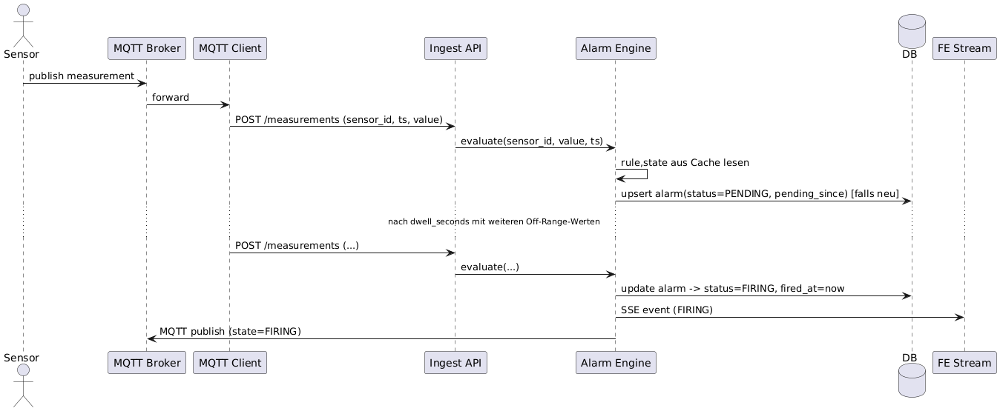
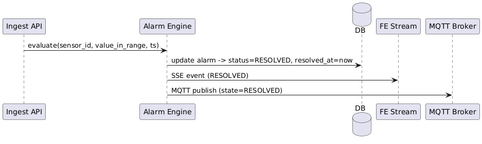

# STORASENSE – Alarmkonzept

## Zielbild
- **Alarm**, wenn Sensorwert **außerhalb** `[min_value, max_value]` liegt **und** dies **≥ dwell_time** (vom User konfigurierbar) anhält.
- **Kein Flapping**: Hysterese + Cooldown, **eine aktive Alarm-Instanz** pro *(user, storage, sensor, rule)*.
- **Skalierbar** auf ~50 Nutzer (≈ bis ~500 Sensoren realistisch), **zustandsbasiert** und **streaming-nah** (Prüfung **beim Ingest** statt teurer DB-Scans).
- **Push** zu FE + Integrationen via **WebSocket/SSE** und **MQTT**.

---

## 1) Nicht-funktionale Anforderungen
- **Skalierung / Parallelität**: Ziel bis **100 Sensoren** (Annahme: Ø 20 Sensoren/User). Ø 1 Messung/Sensor/s ⇒ bis **100 msg/s** Spitze.
- **Latenz**: Alarm-Erkennung < **2 s** nach Erreichen der *dwell_time* (bei kontinuierlichem Ingest).
- **Verfügbarkeit & Robustheit**: Alarm-State wird **in DB persistiert**, aber **im Speicher** (Redis/in-proc) gespiegelt; Crash-sicher dank Perioden-Flush.
- **Kosten / Effizienz**: **Kein Polling** großer Zeiträume; **In-Memory-State** + **Event-getriebene** Updates (Ingest-Pfad, **LISTEN/NOTIFY** bei Regeländerung).

### Parallel-Alarm-Policy (pro Nutzer)
- **Soft-Limit:** **20** gleichzeitige aktive Sensor-Alarme pro User. Ab Erreichen → **Konsolidierung** zu Storage-„Storm“-Alarmen (Zähler + Top-Sensoren) und visuelle Warnung im UI.
- **Hard-Limit:** **50**. Darüber hinaus **keine** neuen Einzel-Alarm-Instanzen; bestehende „Storm“-Alarme werden **aktualisiert**.
- **Ziel:** Alert Fatigue vermeiden, UI & Benachrichtigungen stabil halten, trotzdem Impact sichtbar machen.

---

## 2) Datenmodell

| Tabelle          | Wichtigste Felder                                      | Zweck / Beschreibung                     |
|------------------|-------------------------------------------------------------------------------------|------------------------------------------|
| `Sensor`         | min_value, max_value, **dwell_seconds**, **enabled**                                | Schwellwerte & Mindestdauer je Sensor    |
| `Alarm`          | user_id, storage_id, sensor_id, **status**(PENDING/FIRING/RESOLVED), **pending_since**, **fired_at**, **resolved_at**, **last_value**, **last_ts** | Aktueller/letzter Alarmzustand je Sensor |
| `AlarmEvent` *(neu)* | alarm_id (FK → Alarm.id), ts, state_change(PENDING/FIRING/RESOLVED/ACKED), value, meta(JSONB) | Verlauf/Audit der Zustandswechsel        |

**Beziehungen:**
- `Alarm.sensor_id → Sensor.id`, `Alarm.storage_id → Storage.id`, `Alarm.user_id → User.id`
- `AlarmEvent.alarm_id → Alarm.id`
- Zugriff auf Storages steuert ihr wie bisher über `UserStorageAccess`.

### Indizes
- `Measurements (sensor_id, timestamp DESC)` — schnelle Zeitreihenabfragen
- `Alarm (user_id, status)` und `Alarm (sensor_id, status)` — aktive Alarme filtern
- `AlarmEvent (alarm_id, ts DESC)` — Verlauf pro Alarm effizient anzeigen

---

## 3) Regellogik & Zustandsautomat
**State Machine pro (sensor_id, rule_id):**
- **OK → PENDING**: Wert außerhalb `[min,max]` ⇒ `pending_since` setzen (falls leer).
- **PENDING → FIRING**: `now − pending_since ≥ dwell_seconds` ⇒ `fired_at = now`, Alarm erzeugen/öffnen (falls nicht offen).
- **FIRING → RESOLVED**: Wert **innerhalb** erweiterter **Hysterese** `[min+hyst_min, max−hyst_max]` **für dwell_seconds** ⇒ Alarm schließen (`resolved_at`), **cooldown** starten.
- **Cooldown**: innerhalb `cooldown_seconds` **kein** Re-Trigger (Debounce).
- **Silences/Maintenance**: aktiv ⇒ **kein Trigger**, State läuft intern weiter (Diagnose).

**Zusatz-Regeln (optional, einfach aktivierbar):** No-Data (> X min), Rate-of-Change (ΔWert/Δt), Stuck-Sensor (Varianz ~0 über Y min), Gruppen-/Storage-Regel (ANY/ALL über Sensorgruppe).

---

## 4) Trigger-Pfade
**Primär (Ingest-Pfad, pro Messung):**
1. **Rule-Cache** (sensor_id → rule) aus Redis/in-proc, TTL ~60 s; **Invalidation via Postgres LISTEN/NOTIFY** auf `rule_changes`.
2. **State-Lookup** im Cache (`sensor_id:rule_id`) → State Machine Update.
3. **Persist minimal**: nur **Transitions** in `alarm` / `alarm_event` (nicht jede Messung).
4. **Publish**: WebSocket/SSE + MQTT bei State-Change (PENDING→FIRING, FIRING→RESOLVED, ACKED …).

**Sekundär (Worker, z. B. alle 30 s):** No-Data/Lücken, Recovery-Checks (z. B. nach Neustart, leerem Cache).

**Warum so?** Vermeidet teure "scan last N minutes per sensor"-Queries; DB-Reads nur bei Cache-Miss/Invalidation; Historie/Analytics via Timescale **Continuous Aggregates**.

---

## 5) Caching & Verteilung
- **Single-Instance**: in-proc LRU/TTL Cache (z. B. `cachetools`).
- **Multi-Instance**: **Postgres**‑gestütztes `alarm_state` + `SELECT … FOR UPDATE SKIP LOCKED` bei Workern.
- **Invalidation**: Postgres **LISTEN/NOTIFY** (`rule_changes`).

---

## 6) Dedupe, Grouping, Silences
- **Dedupe-Key**: `user_id:storage_id:sensor_id:rule_id` ⇒ **eine** aktive Instanz.
- **Grouping**: FE/Notifications bündeln pro **Storage‑Alarm** (z. B. ein „Storm“-Alarm mit Liste betroffener Sensoren).
- **Silences & Maintenance-Windows**: zeitgesteuertes Muten (UI‑freundlich). *Best Practices* angelehnt an Alertmanager.

---

## 7) Endpoints
**Realtime:** `GET /stream/alarms` (SSE) **oder** `WS /ws/alarms` – Push von State‑Changes (keyed by user_id).

**Alarm-Verwaltung:**
- `GET /alarms/active?storage_id&sensor_id&severity&limit&cursor`
- `GET /alarms/history?from&to&...` (paginierbar)
- `GET /alarms/{id}`
- `POST /alarms/{id}/ack` (optional: note)
- `POST /silences` / `DELETE /silences/{id}`
- `GET /rules?storage_id|sensor_id`
- `POST /rules` / `PATCH /rules/{id}` (dwell/hysterese/cooldown …)
- `POST /alarms/test` (synthetischer Trigger)

---

## 8) Pseudocode (Ingest-Pfad)
```python
def on_measurement(sensor_id, ts, value):
    rule = rule_cache.get(sensor_id)  # reload via LISTEN/NOTIFY on change
    if not rule or not rule.enabled or in_maintenance(rule, ts) or is_silenced(rule, ts):
        return

    st = state_cache.get((sensor_id, rule.id)) or State("OK")
    bounds = (rule.min_value, rule.max_value)

    if value < bounds[0] or value > bounds[1]:
        if st.state == "OK":
            st.state = "PENDING"; st.pending_since = ts
        elif st.state == "PENDING" and ts - st.pending_since >= rule.dwell_seconds:
            if now() >= (st.cooldown_until or ts):
                fire_alarm(rule, sensor_id, ts, value)   # create/update 'alarm'
                st.state = "FIRING"
    else:
        # inside bounds with hysteresis check
        if st.state in ("PENDING", "FIRING"):
            if is_inside_with_hysteresis(value, rule):
                if st.state == "PENDING":
                    st.state = "OK"; st.pending_since = None
                elif st.state == "FIRING":
                    resolve_alarm(rule, sensor_id, ts, value)
                    st.state = "OK"; st.cooldown_until = now() + rule.cooldown_seconds

    st.last_value, st.last_ts = value, ts
    state_cache[(sensor_id, rule.id)] = st
```

---

## 9) Sequenzdiagramme

**1) Auslösung (PENDING → FIRING)**



**2) Auflösung (FIRING → RESOLVED)**


---

### Quellen
- [1] [Google SRE Book – Monitoring Distributed Systems] https://sre.google/sre-book/monitoring-distributed-systems/
- [2] [Google SRE Book – Practical Alerting] https://sre.google/sre-book/practical-alerting/
- [3] [Prometheus Alertmanager – Overview] https://prometheus.io/docs/alerting/latest/alertmanager/
- [4] [Prometheus Alertmanager – Configuration] https://prometheus.io/docs/alerting/latest/configuration/
- [5] [PostgreSQL – LISTEN] https://www.postgresql.org/docs/current/sql-listen.html
- [6] [PostgreSQL – NOTIFY] https://www.postgresql.org/docs/current/sql-notify.html
- [7] [TimescaleDB – Continuous Aggregates (Guide)] https://docs.timescale.com/use-timescale/latest/continuous-aggregates/
- [8] [TimescaleDB – About Continuous Aggregates] https://docs.timescale.com/use-timescale/latest/continuous-aggregates/about-continuous-aggregates/
- [9] [OASIS – MQTT v5.0 Specification] https://docs.oasis-open.org/mqtt/mqtt/v5.0/mqtt-v5.0.html
- [10] [HiveMQ – MQTT Essentials Part 6: QoS Levels] https://www.hivemq.com/blog/mqtt-essentials-part-6-mqtt-quality-of-service-levels/
- [11] [HiveMQ – MQTT Essentials Part 8: Retained Messages] https://www.hivemq.com/blog/mqtt-essentials-part-8-retained-messages/
- [12] [MDN – Server-Sent Events (EventSource)] https://developer.mozilla.org/en-US/docs/Web/API/EventSource
- [13] [WHATWG – HTML Living Standard: Server-sent events] https://html.spec.whatwg.org/multipage/server-sent-events.html
