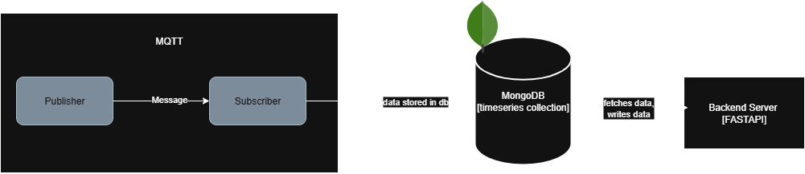
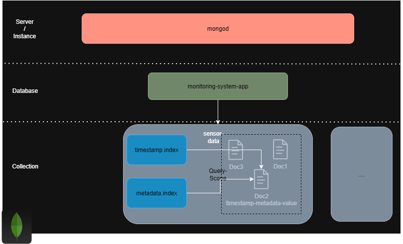

# Datendomäne

Für den Betrieb der Überwachungsplattform wird ein hybrider Ansatz zur Datenhaltung gewählt.
Das System nutzt zwei separate Datenbanken, die jeweils für ihren Anwendungsfall optimiert sind:
* eine dokumentenbasierte NoSQL-Datenbank für die massenhafte Speicherung von Sensordaten.
* eine relationale Datenbank für die strukturierte Verwaltung des Systems, beispielsweise seiner Benutzerdaten.

## 1. Speicherung von Sensordaten
Dieser Teil des Systems ist für die Speicherung der von den Sensoren übermittelten Messwerte zuständig,
die durch den MQTT-Broker an das Backend-System geleitet werden. <br>
Hierbei handelt es sich um einen kontinuierlichen Strom von Zeitreihendaten.

### Datenspeicher - Dokumentenbasierte NoSQL-Datenbank
Die Entscheidung für eine dokumentenbasierte NoSQL-Datenbank zur Speicherung der Sensordaten begründet sich
aus der Art und Struktur der anfallenden Daten.
Jeder einzelne (atomare) Messwert eines Sensors kann als ein in sich geschlossenes, eigenständiges Informationspaket – ein Dokument – betrachtet werden.
Diese alle relevanten Informationen enthaltene Dokumente zeigen hier mehrere Vorteile gegenüber einer relationalen Datenbank [1] [2]:

* **Flexibilität**: Die Struktur der Sensordaten kann variieren, da verschiedene Sensoren unterschiedliche Messwerte liefern. NoSQL-Datenbanken ermöglichen es, Dokumente mit unterschiedlichen Feldern zu speichern, ohne dass ein striktes Schema bzw eine Normalisierung erforderlich ist. Diese Dokumente werden anschließend zu Collections gruppiert. <br>
<br>
* **Natürliche Datenabbildung**: Die Dokumentenstruktur (JSON-Format) entspricht direkt den Datenobjekten, wie sie zum Beispiel in Python-Dictionaries verwendet werden. Dies vereinfacht die Entwicklung und optimiert die Datenbankoperationen, da keine komplexe Umwandlung zwischen dem Anwendungs- und dem Datenbankmodell (Object-Relational Mapping) notwendig ist. Weiter werden ebenfalls im MQTT-System die Nachrichten im JSON-Format übermittelt. <br>
<br>

* **Performance**:
  - **Schreibvorgänge**: NoSQL-Datenbanken bieten i.d.R. eine hohe Schreibgeschwindigkeit, was für die kontinuierliche Erfassung von Sensordaten wichtig ist. Beispielsweise wird ein einzelner Messwert als ein atomarer Schreibvorgang in einem einzigen Dokument gespeichert - während in einem relationalen Modell ein solcher Schreibvorgang möglicherweise auf mehrere Tabellen aufgeteilt werden müsste, was die Latenz erhöht.
  - **Lesevorgänge**: Abfragen von Sensordaten sind in NoSQL-Datenbanken in der Regel schneller, da um alle Informationen zu einem einzelnen Messwert abzurufen nur ein einziges Dokument gelesen werden muss. In einem relationalen Modell wären potenziell mehrere JOIN-Operationen über verschiedene Tabellen notwendig, was Abfragen verlangsamen kann. <br>

<br>

### MongoDB als ausgewählter Datenspeicher




Die Wahl fiel auf MongoDB als dokumentenbasierte NoSQL-Datenbank, da sie folgende Vorteile bietet [3]:
* **Popularität**: MongoDB ist eine der am weitesten verbreiteten NoSQL-Datenbanken und hat eine große Community sowie umfangreiche Dokumentation. Für jede (praktische) Programmiersprache gibt es unterstützende Treiber - für Python beispielsweise den offiziellen Treiber **pymongo** [4].
* **Abfragesprache**: Obwohl MongoDB schemalos ist, verfügt es über eine mächtige Abfragesprache: **MQL**. Mittels des "Aggregation Frameworks" lassen sich komplexere Datenverarbeitungs-Pipelines direkt auf der Datenbank auszuführen. Diese ermöglichen die historische Datenanalyse, indem beispielsweise Durchschnittswerte oder Minima/Maxima über Zeiträume berechnet werden können.
* **Hohe Performance**: MongoDB weist eine hohe Lese- und Schreibleistung auf. Es unterstützt flexible Indizierungsmöglichkeiten (verschiedener Attribute), insbesondere die für den IoT-Usecase relevante Zeitreihen-Indizes (**timeseries collections**) [7], die beispielsweise Abfragen auf Basis von Zeitstempeln beschleunigen [2] [3].
* **Flexibles Deployment**: MongoDB kann kostenlos sowohl lokal - per **Docker Image** [5] - als auch in dem Cloud-Dienst **MongoDB-Atlas** [6] betrieben werden.

### Datenmodell



Die Sensordaten werden in einer **timeseries collection** gespeichert, die speziell für Zeitreihendaten optimiert ist [7].
Hierbei handelt es sich um eine Sammlung von Dokumenten, die jeweils einen einzelnen Messwert eines Sensors repräsentieren.

Fachlich gilt es folgende Informationen innerhalb eines Dokuments zu speichern:

| Field          | Data Type | Description                                                                                  |
|----------------|-----------|----------------------------------------------------------------------------------------------|
| timestamp      | DateTime  | (timeField) The exact timestamp of the measurement. Serves as the primary sorting criterion. |
| metadata       | Object    | (metaField) Object that bundles all descriptive metadata of the data source.                 |
| => location_id | String    | ID of the storage location (foreign key to the relational DB).                               |
| => sensor_type | String    | Type of sensor (e.g. "temperature", "humidity").                                             |
| => unit        | String    | The associated unit of the measured value (e.g. "°C", "%").                                  |
| value          | Float     | The recorded numerical value of the sensor.                                                  |

Beispiel eines Dokuments in der MongoDB-Datenbank:

```json
{
  "timestamp": ISODate("2023-10-01T12:00:00Z"),
  "meta": {
    "location_id": "vinbasement_1",
    "sensor_type": "temperature",
    "unit": "°C"
  },
  "value": 20.5
}
```

Für optimale Performance bzw eine schnelle Abfrage der Sensordaten führt MongoDB intern folgende Optimierungsschritte durch (vereinfacht) [8]:
* **Bucketing**: MongoDB speichert nicht jeden einzelnen Messwert als separates Dokument auf der Festplatte. Stattdessen fasst es Messwerte, die in einem kurzen Zeitfenster anfallen und die exakt gleichen Metadaten haben (z.B. gleicher Lagerort, gleicher Sensortyp), automatisch in internen Buckets zusammen.
* **Indexierung**: Indizes werden auf die Felder **timestamp** und **metadata** gesetzt.

## 2. Speicherung von Systemdaten
Dieser Teil des Systems bildet die organisatorische Grundlage für die strukturierte Verwaltung des Systems, wie z.B. Benutzerdaten, Rollen und Lagerorte.

### Datenspeicher - SQL-Datenbank
Für die Speicherung dieser Daten wird eine relationale SQL-Datenbank aus folgenden Gründen gewählt:


Quellen:
* [1] https://www.ionos.com/digitalguide/hosting/technical-matters/nosql/
* [2] https://www.researchgate.net/publication/374642103_ADVANTAGES_AND_CHALLENGES_OF_NOSQL_COMPARED_TO_SQL_DATABASES_-_A_SYSTEMATIC_LITERATURE_REVIEW
* [3] https://www.mongodb.com/resources/compare/advantages-of-mongodb
* [4] https://medium.com/@georgelza/generating-realistic-iot-data-using-python-storing-into-mongodb-timeseries-collection-part-4-7ef6c7bf8192
* [5] https://www.mongodb.com/docs/manual/tutorial/install-mongodb-community-with-docker/
* [6] https://www.mongodb.com/docs/atlas/getting-started/
* [7] https://www.mongodb.com/docs/manual/core/timeseries-collections/
* [8] https://www.mongodb.com/docs/manual/core/timeseries/timeseries-bucketing/
