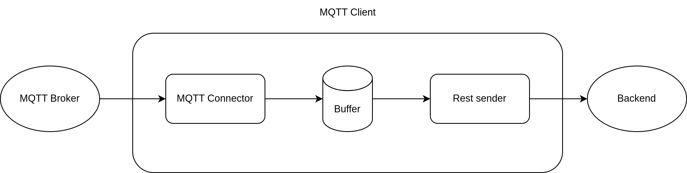

# MQTT Client

## Fuktionalität
Aus der [Architektur](arc.md#sequenzablauf---data-flow-erzeugung---ingestion---speicherung-alarmierung)
und dem [MVP](mvp.md#funktionale-anforderungen)
könnnen folgende nicht funktionale Anforderungen an den MQTT Client abgeleitet werden.
- __Resillienz gegen Fehler:__ Der Client sollte sowohl den Ausfall des Brokers sowie den des Backends abfangen, und sich selbstsändig wieder verbinden kömnen.
- __Verhinderung von Datenverlust:__ Der Client sollte bei Ausfall des Backends die Nachrichten des Brokers zwischenspeichern(cashen).

## Architektur
Um das Cashing zu realisieren, müssen die Nachrichten des Brokers zwischengespeichert werden.
Dies wird durch eine SQL Datenbank realisiert.
Diese Datenbankarchitektur wurde aufgrund der zu erwartenden geringen Datenmenge gewählt.
Des Weiteren ist die Persistenz der Nachrichten bei einer SQL Datenbank ohne weitere Konfiguration gegeben.
Um gecashte Nachrichten auch versenden zu können, wenn keine neuen Nachrichten vom Broker empfangen werden,wird das versenden in einen eigenen Thread ausgelagert.
Dies wurde einer eigenständigem Service vorgezogen, um die Komplexität des Dockerfiles zu reduzieren.
Der Ablauf einer Nachricht wird in folgender Abbildung dargestellt:

## Umsetzung
Der  Client wird nach dem in der [Architektur](arc.md) beschriebenen Konzept in Python umgesetzt.
Für den MQTT Connector wird die Bibliothek `paho-mqtt` verwendet, da diese einen weiten Verbreitungsgrad hst
und alle nötigen Funktionalitäten bietet.
Die Bufferdatenbank wird mithilfe einer Sqlite Datenbank realisiert. Diese wurde gewählt, da die zu erwartende
Datenmenge äusserst gering ist, und die Datenbank einfach zu konfigurieren ist.
Das Senden der Nachrichten wird mithilfe der request Bibliothek umgesetzt.
Alle drei Komponenten sind in eigenen Dokumenten umgesetzt.
