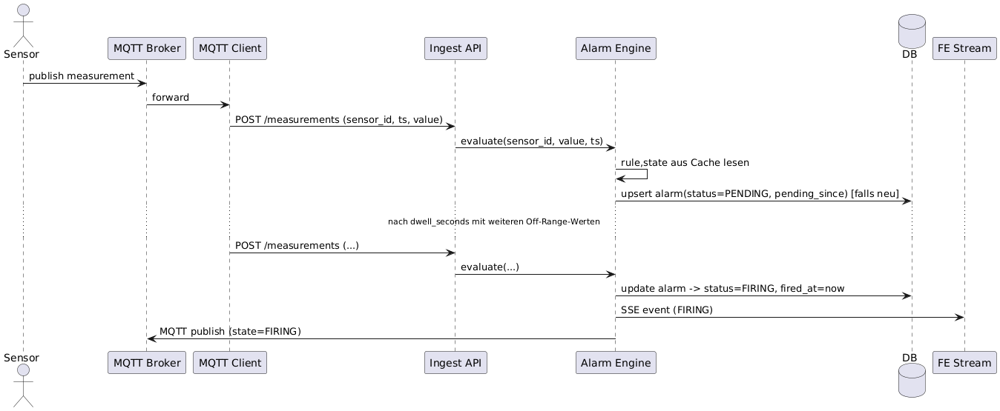
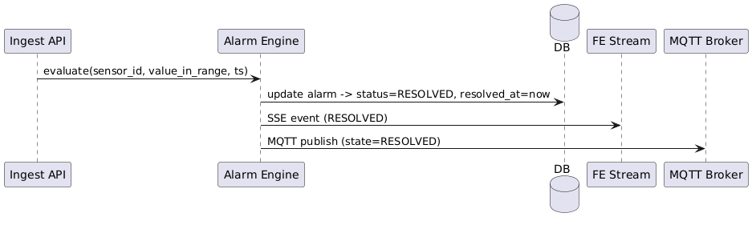

# STORASENSE - Projektüberblick / MVP

## Ziel des MVP

Ziel dieses Minimal Viable Products (MVP) ist die Entwicklung eines einfachen, funktionalen Systems zur Erfassung und Überwachung von Umweltdaten – konkret Temperatur und Luftfeuchtigkeit – über Sensoren, deren Messwerte gespeichert, ausgewertet und überwacht werden. Das System dient als Grundlage für eine spätere Erweiterung mit zusätzlichen Sensoren und Benachrichtigungsmechanismen.

## Systemüberblick

Das System basiert auf einer Hardwarekomponente (Arduino mit angeschlossenen Sensoren), welche die gemessenen Umweltdaten regelmäßig über das MQTT-Protokoll an einen Server übermittelt.

Die empfangenen Messwerte werden in einer permanenten Datenbank gespeichert und über eine grafische Benutzeroberfläche visualisiert. Darüber hinaus kann der Benutzer individuelle Schwellenwerte für Temperatur definieren. Wird ein definierter Temperaturbereich überschritten oder unterschritten, so wird automatisch eine Warnung ausgegeben und an den MQTT-Broker gesendet. Bei Grenzwertüberschreitungen wird zudem ein neues MQTT-Topic veröffentlicht, das von anderen Komponenten abonniert werden kann, um z. B. automatisierte Reaktionen auszulösen.

## Funktionale Anforderungen

- Das System misst alle 30 Sekunden verschiedene Sensorwerte - anfangs insbesondere die **Temperatur** und **Luftfeuchtigkeit** über angeschlossene Sensoren.
- Die Messergebnisse werden in einer **permanenten Datenbank** gespeichert.
- Der Benutzer kann über eine **grafische Benutzeroberfläche** einen **Temperatur-Mindestwert** und einen **Temperatur-Höchstwert** definieren.
- Liegt die gemessene Temperatur **außerhalb des definierten Bereichs**, wird automatisch eine **Warnung** erzeugt.
- Die Warnung wird über den **MQTT-Broker** veröffentlicht: Bei einer Grenzwertverletzung wird eine Nachricht auf ein dafür vorgesehenes **MQTT-Topic** geschickt, auf das andere Systeme oder Komponenten zugreifen können (z. B. zur Steuerung von Aktoren). In der Plattformoberfläche wird die Warnung innerhalb einer Alarmhistorie eines Lagerraums (stellt die letzten 500 Alarme des Lagerraums dar) ebenfalls angezeigt.
- Die Benutzeroberfläche stellt ein **aktives Dashboard** dar, das die aktuellen Sensordaten in Echtzeit visualisiert.
- Das System verwaltet Benutzer (bis zu ~500), die verschiedene Rollen haben können (z. B. Admin, User).
- Weiter erlaubt das System die Verwaltung von Lagerorten (bis zu ~500), die jeweils mit den gegebenen Sensoren verbunden sein können.

## Nicht-funktionale Anforderungen

- **Verfügbarkeit des Systems**:
    - Das System soll eine **Verfügbarkeit von 99% innerhlab eines Zeitraums von drei Tagen** aufweisen.
    - Falls das System abstürzt, wird es versuchen, sich **automatisch bis zu drei Mal in kurzen Abständen neu zu starten**.
- **Sicherheit des Systems**: Authentifizierung und Autorisierung
- **Performance des Systems**: Schnelles Alamierungssystem - Push-Benachrichtigung und MQTT-Benachrichtigung innerhalb von 90 Sekunden nachdem der festgelegte Toleranzbereich des Sensors für länger als 30s verletzt wird.

## Optionale Erweiterungen

Die folgenden Funktionen sind nicht Bestandteil des MVPs, können jedoch zu einem späteren Zeitpunkt ergänzt werden:

- **Sensor zur Erkennung von Kohlenwasserstoffen** zur Überwachung der Luftqualität
- **Ultraschallsensor zur Türüberwachung**, z. B. zur Anwesenheitserkennung oder Zutrittskontrolle
- **Benachrichtigung per Push-Nachricht** bei Grenzwertüberschreitungen oder anderen definierten Ereignissen

## Rahmenbedingungen
### Technische
- Hardware: Arduino-Mikrocontroller mit (voraussichtlich) vier angeschlossenen Sensoren, die folgende Daten liefern: Temperaturmesswert, Luftfeuchtigkeitsmesswert, Kohlenwasserstoffmesswert, Zustand der Tür (offen/geschlossen)
- Gestellter MQTT-Broker nach Pub/Sub-Muster
- Python als Programmiersprache für die Backend-Entwicklung

### Organisatorische
- Entwicklungszeitraum: 2.5 Monate
- Teamgröße: 4 Personen

## Software-FMEA Analyse
Folgende SFMEA-Analyse dient der Identifizierung potenzieller Schwachstellen des Systems - insbesondere des oben beschriebenen MVPs:
Dafür wird das Gesamtsystem STORASENSE in seine Teilsysteme gegliedert und analysiert:

### Legende:
**Bedeutung (B)**: Auswirkung des Fehlers (1 = keine Auswirkung, 10 = totaler Schaden)

**Auftreten (A)**: Wahrscheinlichkeit des Auftretens der Ursache (1 = sehr unwahrscheinlich, 10 = sehr wahrscheinlich)

**Entdeckung (E)**: Wahrscheinlichkeit, dass der Fehler entdeckt wird, bevor er Schaden anrichtet (1 = sehr wahrscheinlich entdeckt, 10 = nicht zu entdecken)

**Risikoprioritätszahl (RPZ)**: B × A × E (hoher Wert = Handlungsbedarf)

### 1. STORASENSE-SENSORIC: Sensor-Einheit (Hardware):
Verantwortlich für die Erfassung der physikalischen Messwerte.

| Fehlermöglichkeit                        | Fehlerauswirkung                                                                           | B  | Fehlerursache                                                        | A  | Maßnahmen                                                                                                                                     | E  | RPZ |
|------------------------------------------|--------------------------------------------------------------------------------------------|----|----------------------------------------------------------------------|----|-----------------------------------------------------------------------------------------------------------------------------------------------|----|-----|
| Sensor liefert dauerhaft falsche Werte   | Falsche Daten werden gespeichert; Alarme werden fälschlicherweise ausgelöst oder gar nicht. | 9  | Sensor defekt oder Programmierfehler beim Auslesen.                  | 4  | Plausibilitäts-Checks im Backend (z\.B\. Temperatur springt nicht von 10°C auf 50°C). Implementierung von Algorithmen zur Ausreißer-Erkennung | 5  | 180 |
| Mikrocontroller (Arduino) friert ein     | Keine neuen Messwerte werden mehr gesendet und Überwachung fällt komplett aus.             | 10 | Software-Bug (z.B. Endlosschleife) oder Speicherüberlauf.            | 3  | Hardware-Watchdog-Timer, der den Arduino automatisch neu startet (vgl. NF-Req Verfügbarkeit). Einsatz eines robusten Watchdog-Timers.         | 2  | 60  |
| Verlust der WLAN-Verbindung              | Keine neuen Messwerte werden an den MQTT-Broker gesendet.                                  | 8  | WLAN-Router ausgefallen oder falsches Passwort. | 5  | Implementierte Wiederverbindungs-Logik auf dem Mikrocontroller (vgl. NF-Req Verfügbarkeit). Backend überwacht den Zeitstempel der letzten Nachricht pro Sensor und löst einen "Verbindungsverlust"-Alarm aus.                                                  | 3  | 120 |

### 2. STORASENSE-PLATFORM: Backend (FastAPI-Anwendung)
Verantwortlich für die Datenverarbeitung, Speicherung, Alarmierung und API-Bereitstellung.

| Fehlermöglichkeit                        | Fehlerauswirkung                                                                                                                | B  | Fehlerursache                                                                                   | A  | Maßnahmen                                                                                                                                                                                                                               | E  | RPZ |
|------------------------------------------|---------------------------------------------------------------------------------------------------------------------------------|----|-------------------------------------------------------------------------------------------------|----|-----------------------------------------------------------------------------------------------------------------------------------------------------------------------------------------------------------------------------------------|----|-----|
| FastAPI-Anwendung stürzt ab              | Das gesamte System ist offline.                                                                                                 | 10 | Unbehandelter Fehler im Code (z.B. TypeError).                                                  | 4  | Einsatz eines Prozess-Managers (z.B. systemd), der die Anwendung bei einem Absturz automatisch neu startet. Implementierung eines zentralen Logging-Systems (zur Analyse der Absturzursache) und Einrichten eines HEALTH-API-Endpunktes. | 2  | 80  |
| Verbindung zur Datenbank (MongoDB/SQLite) geht verloren | Eingehende Messwerte können nicht gespeichert werden; Nutzer können sich nicht anmelden oder Daten abrufen.                     | 8  | Datenbank-Server ist offline; Netzwerkproblem bzw Docker-Problem; falsche Zugangsdaten.         | 3  | Fehlerbehandlung (try-except Exception Handling) im Code; Wiederverbindungs-Logik im Datenbanktreiber.                                                                                                                                  | 4  | 96  |
| Alarm wird nicht ausgelöst                | Ein kritischer Zustand (z.B. zu hohe Temperatur) wird erkannt, aber der Nutzer wird nicht benachrichtigt. Der Schaden passiert. | 10 | Fehler im Alarmierungs-Code; externer E-Mail/Push-Dienst ist ausgefallen; falsche Konfiguration. | 2  | Unit-Tests für die Alarm-Logik.                                                                                                                                                                                                         | 6  | 120 |
| Unbefugter Zugriff auf API (Authentifizierungsfehler) | Ein anonymer Angreifer kann geschützte Daten auslesen oder schreibend verändern. Kompromittierung der Datensicherheit. | 9  | API-Endpunkt ist nicht geschützt; schwache Passwort-Richtlinien; kein Schutz vor Brute-Force-Angriffen. | 5  | Implementierung von OAuth2 mit JWT-Tokens für jeden geschützten Endpunkt; Sicheres Passwort-Hashing                                                         | 3  | 135 |
| Unberechtigter Zugriff auf Daten (Autorisierungsfehler) | Ein angemeldeter Nutzer greift auf Daten zu, für die er keine Berechtigung hat (z\.B\. Daten eines anderen Nutzers). | 8  | Fehlerhafte oder fehlende Prüfung der Benutzerrolle oder des Datenbesitzes innerhalb der API-Logik. | 4  | Implementierung einer rollenbasierten Zugriffskontrolle (RBAC); API-Logik prüft bei jeder Anfrage, ob der Nutzer die erforderliche Rolle (Admin, User) hat.                                               | 4  | 128 |


# Alarmkonzept

## Zielbild
- **Alarm**, wenn Sensorwert **außerhalb** `[min_value, max_value]` liegt **und** dies **≥ dwell_time** (vom User konfigurierbar) anhält.
- **Kein Flapping**: Hysterese + Cooldown, **eine aktive Alarm-Instanz** pro *(user, storage, sensor, rule)*.
- **Skalierbar** auf ~50 Nutzer (≈ bis ~500 Sensoren realistisch), **zustandsbasiert** und **streaming-nah** (Prüfung **beim Ingest** statt teurer DB-Scans).
- **Push** zu FE + Integrationen via **WebSocket/SSE** und **MQTT**.

---

## 1) Nicht-funktionale Anforderungen
- **Skalierung / Parallelität**: Ziel bis **100 Sensoren** (Annahme: Ø 20 Sensoren/User). Ø 1 Messung/Sensor/s ⇒ bis **100 msg/s** Spitze.
- **Latenz**: Alarm-Erkennung < **2 s** nach Erreichen der *dwell_time* (bei kontinuierlichem Ingest).
- **Verfügbarkeit & Robustheit**: Alarm-State wird **in DB persistiert**, aber **im Speicher** (Redis/in-proc) gespiegelt; Crash-sicher dank Perioden-Flush.
- **Kosten / Effizienz**: **Kein Polling** großer Zeiträume; **In-Memory-State** + **Event-getriebene** Updates (Ingest-Pfad, **LISTEN/NOTIFY** bei Regeländerung).

### Parallel-Alarm-Policy (pro Nutzer)
- **Soft-Limit:** **20** gleichzeitige aktive Sensor-Alarme pro User. Ab Erreichen → **Konsolidierung** zu Storage-„Storm“-Alarmen (Zähler + Top-Sensoren) und visuelle Warnung im UI.
- **Hard-Limit:** **50**. Darüber hinaus **keine** neuen Einzel-Alarm-Instanzen; bestehende „Storm“-Alarme werden **aktualisiert**.
- **Ziel:** Alert Fatigue vermeiden, UI & Benachrichtigungen stabil halten, trotzdem Impact sichtbar machen.

---

## 2) Datenmodell

| Tabelle          | Wichtigste Felder                                      | Zweck / Beschreibung                     |
|------------------|-------------------------------------------------------------------------------------|------------------------------------------|
| `Sensor`         | min_value, max_value, **dwell_seconds**, **enabled**                                | Schwellwerte & Mindestdauer je Sensor    |
| `Alarm`          | user_id, storage_id, sensor_id, **status**(PENDING/FIRING/RESOLVED), **pending_since**, **fired_at**, **resolved_at**, **last_value**, **last_ts** | Aktueller/letzter Alarmzustand je Sensor |
| `AlarmEvent` *(neu)* | alarm_id (FK → Alarm.id), ts, state_change(PENDING/FIRING/RESOLVED/ACKED), value, meta(JSONB) | Verlauf/Audit der Zustandswechsel        |

**Beziehungen:**
- `Alarm.sensor_id → Sensor.id`, `Alarm.storage_id → Storage.id`, `Alarm.user_id → User.id`
- `AlarmEvent.alarm_id → Alarm.id`
- Zugriff auf Storages steuert ihr wie bisher über `UserStorageAccess`.

### Indizes
- `Measurements (sensor_id, timestamp DESC)` — schnelle Zeitreihenabfragen
- `Alarm (user_id, status)` und `Alarm (sensor_id, status)` — aktive Alarme filtern
- `AlarmEvent (alarm_id, ts DESC)` — Verlauf pro Alarm effizient anzeigen

---

## 3) Regellogik & Zustandsautomat
**State Machine pro (sensor_id, rule_id):**
- **OK → PENDING**: Wert außerhalb `[min,max]` ⇒ `pending_since` setzen (falls leer).
- **PENDING → FIRING**: `now − pending_since ≥ dwell_seconds` ⇒ `fired_at = now`, Alarm erzeugen/öffnen (falls nicht offen).
- **FIRING → RESOLVED**: Wert **innerhalb** erweiterter **Hysterese** `[min+hyst_min, max−hyst_max]` **für dwell_seconds** ⇒ Alarm schließen (`resolved_at`), **cooldown** starten.
- **Cooldown**: innerhalb `cooldown_seconds` **kein** Re-Trigger (Debounce).
- **Silences/Maintenance**: aktiv ⇒ **kein Trigger**, State läuft intern weiter (Diagnose).

**Zusatz-Regeln (optional, einfach aktivierbar):** No-Data (> X min), Rate-of-Change (ΔWert/Δt), Stuck-Sensor (Varianz ~0 über Y min), Gruppen-/Storage-Regel (ANY/ALL über Sensorgruppe).

---

## 4) Trigger-Pfade
**Primär (Ingest-Pfad, pro Messung):**
1. **Rule-Cache** (sensor_id → rule) aus Redis/in-proc, TTL ~60 s; **Invalidation via Postgres LISTEN/NOTIFY** auf `rule_changes`.
2. **State-Lookup** im Cache (`sensor_id:rule_id`) → State Machine Update.
3. **Persist minimal**: nur **Transitions** in `alarm` / `alarm_event` (nicht jede Messung).
4. **Publish**: WebSocket/SSE + MQTT bei State-Change (PENDING→FIRING, FIRING→RESOLVED, ACKED …).

**Sekundär (Worker, z. B. alle 30 s):** No-Data/Lücken, Recovery-Checks (z. B. nach Neustart, leerem Cache).

**Warum so?** Vermeidet teure "scan last N minutes per sensor"-Queries; DB-Reads nur bei Cache-Miss/Invalidation; Historie/Analytics via Timescale **Continuous Aggregates**.

---

## 5) Caching & Verteilung
- **Single-Instance**: in-proc LRU/TTL Cache (z. B. `cachetools`).
- **Multi-Instance**: **Postgres**‑gestütztes `alarm_state` + `SELECT … FOR UPDATE SKIP LOCKED` bei Workern.
- **Invalidation**: Postgres **LISTEN/NOTIFY** (`rule_changes`).

---

## 6) Dedupe, Grouping, Silences
- **Dedupe-Key**: `user_id:storage_id:sensor_id:rule_id` ⇒ **eine** aktive Instanz.
- **Grouping**: FE/Notifications bündeln pro **Storage‑Alarm** (z. B. ein „Storm“-Alarm mit Liste betroffener Sensoren).
- **Silences & Maintenance-Windows**: zeitgesteuertes Muten (UI‑freundlich). *Best Practices* angelehnt an Alertmanager.

---

## 7) Endpoints
**Realtime:** `GET /stream/alarms` (SSE) **oder** `WS /ws/alarms` – Push von State‑Changes (keyed by user_id).

**Alarm-Verwaltung:**
- `GET /alarms/active?storage_id&sensor_id&severity&limit&cursor`
- `GET /alarms/history?from&to&...` (paginierbar)
- `GET /alarms/{id}`
- `POST /alarms/{id}/ack` (optional: note)
- `POST /silences` / `DELETE /silences/{id}`
- `GET /rules?storage_id|sensor_id`
- `POST /rules` / `PATCH /rules/{id}` (dwell/hysterese/cooldown …)
- `POST /alarms/test` (synthetischer Trigger)

---

## 8) Pseudocode (Ingest-Pfad)
```python
def on_measurement(sensor_id, ts, value):
    rule = rule_cache.get(sensor_id)  # reload via LISTEN/NOTIFY on change
    if not rule or not rule.enabled or in_maintenance(rule, ts) or is_silenced(rule, ts):
        return

    st = state_cache.get((sensor_id, rule.id)) or State("OK")
    bounds = (rule.min_value, rule.max_value)

    if value < bounds[0] or value > bounds[1]:
        if st.state == "OK":
            st.state = "PENDING"; st.pending_since = ts
        elif st.state == "PENDING" and ts - st.pending_since >= rule.dwell_seconds:
            if now() >= (st.cooldown_until or ts):
                fire_alarm(rule, sensor_id, ts, value)   # create/update 'alarm'
                st.state = "FIRING"
    else:
        # inside bounds with hysteresis check
        if st.state in ("PENDING", "FIRING"):
            if is_inside_with_hysteresis(value, rule):
                if st.state == "PENDING":
                    st.state = "OK"; st.pending_since = None
                elif st.state == "FIRING":
                    resolve_alarm(rule, sensor_id, ts, value)
                    st.state = "OK"; st.cooldown_until = now() + rule.cooldown_seconds

    st.last_value, st.last_ts = value, ts
    state_cache[(sensor_id, rule.id)] = st
```

---

## 9) Sequenzdiagramme

**1) Auslösung (PENDING → FIRING)**



**2) Auflösung (FIRING → RESOLVED)**


---

### Quellen
- [1] [Google SRE Book – Monitoring Distributed Systems](https://sre.google/sre-book/monitoring-distributed-systems/)
- [2] [Google SRE Book – Practical Alerting](https://sre.google/sre-book/practical-alerting/)
- [3] [Prometheus Alertmanager – Overview](https://prometheus.io/docs/alerting/latest/alertmanager/)
- [4] [Prometheus Alertmanager – Configuration](https://prometheus.io/docs/alerting/latest/configuration/)
- [5] [PostgreSQL – LISTEN](https://www.postgresql.org/docs/current/sql-listen.html)
- [6] [PostgreSQL – NOTIFY](https://www.postgresql.org/docs/current/sql-notify.html)
- [7] [TimescaleDB – Continuous Aggregates (Guide)](https://docs.timescale.com/use-timescale/latest/continuous-aggregates/)
- [8] [TimescaleDB – About Continuous Aggregates](https://docs.timescale.com/use-timescale/latest/continuous-aggregates/about-continuous-aggregates/)
- [9] [OASIS – MQTT v5.0 Specification](https://docs.oasis-open.org/mqtt/mqtt/v5.0/mqtt-v5.0.html)
- [10] [HiveMQ – MQTT Essentials Part 6: QoS Levels](https://www.hivemq.com/blog/mqtt-essentials-part-6-mqtt-quality-of-service-levels/)
- [11] [HiveMQ – MQTT Essentials Part 8: Retained Messages](https://www.hivemq.com/blog/mqtt-essentials-part-8-retained-messages/)
- [12] [MDN – Server-Sent Events (EventSource)](https://developer.mozilla.org/en-US/docs/Web/API/EventSource)
- [13] [WHATWG – HTML Living Standard: Server-sent events](https://html.spec.whatwg.org/multipage/server-sent-events.html)


## Hinweise

Da es sich um ein MVP handelt, liegt der Fokus zunächst auf der Umsetzung der Kernfunktionen (Datenaufnahme, Speicherung, Warnung). Erweiterte Funktionalitäten, Sicherheit auf Anwendungsebene sowie Skalierbarkeit sind nicht Bestandteil des ersten Releases, können aber im Rahmen weiterer Iterationen realisiert werden.
